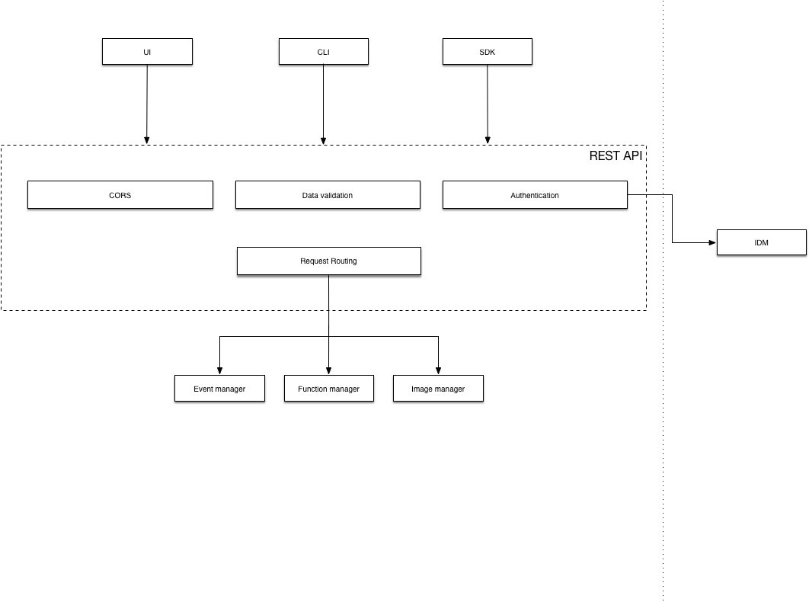

# REST API

An external gateway to VMware serverless platform, used by users and 3rd party systems to create functions and consume their output.

## Problem statement

Users need to be able to interact with serverless system.  

### User stories

1. As an *administrator*, I want platform users to only access Serverless platform upon successful authentication.
2. As an *administrator*, I want to configure external identity source to be used with Serverless platform. 
3. As a *developer*, I want to create a serverless *function* and retrieve its *result*.
4. As a *developer*, I want to *list* all functions defined by me.
`...`

## Proposed Solution

A Serverless API, an external-facing, RESTful, stateless component in Serverless system, responsible for:

* Serving user requests - whether they come from UI, CLI, or direct API calls, Serverless API is the entry point for user interactions.
* Providing means for user to authenticate himself.
* Ensuring requests are authorized to perform certain action.
* Routing requests to correct worker components, and formatting their response.
* Dealing with CORS (UI).
* Ensuring RESTfulness of API.
* Terminates SSL (optional, as a common practice is to use reverse proxy to do that)

## Requirements

* External identity source.
* Serverless platform components to which work will be forwarded.

## Design

serverles

### Request processing

Each request/response received/sent by REST API goes through processing layers (*middlewares*):
* `authentication` - Verify provided credentials and deny the request if deemed incorrect.
* `CORS` - Set response headers needed for Cross-Origin Requests.
* `validation` - Validate request payload for given operation.
* `routing` - Route request to correct handler/backend system. 

### REST resources exposed by API

This is an overview of resources exposed by our API. The detailed list including their specification will be stored in form of swagger document.

* `/functions` - Functions CRUD, functions control (execute, inspect, kill). See [Function gateway](../function-gateway/function-gateway.md) for details.
* `/events` - Events CRUD, triggering. See [Event gateway](../event-gateway/event-gateway.md).
* `/subscriptions` - Subscriptions CRUD (subscribe function to an event and vice-versa). [Event gateway](../event-gateway/event-gateway.md).
* `/images` - Images (manage base images for function execution). See [Image Manager](../image-manager/image-manager.md).
* `/auth` - Everything related to authentication. See [Authentication]().

## Milestones

TBD

## Open Issues

* Can we ensure REST API statelessness ?
